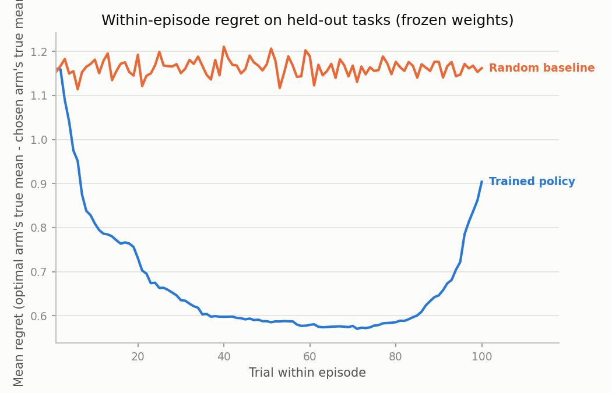
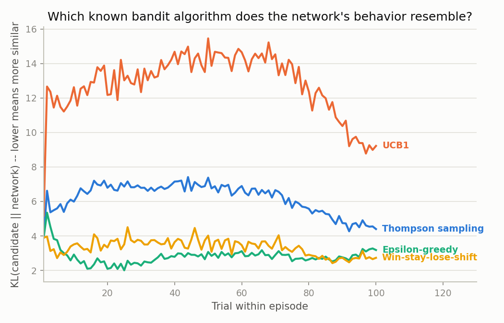
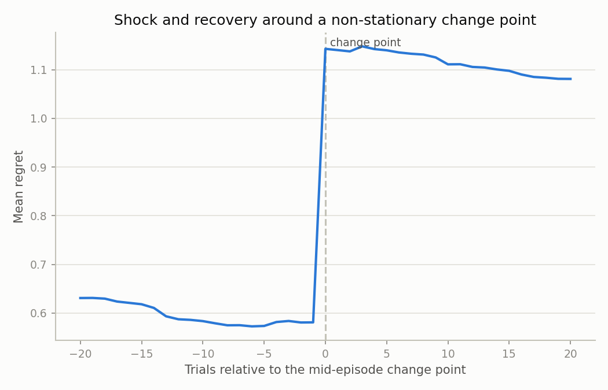

# MesaRL — Reverse-Engineering an Emergent Mesa-Optimizer

An empirical mesa-optimization research project: meta-train a Transformer via PPO across thousands of randomly sampled multi-armed bandit tasks, show that its frozen weights implement their own in-context learning algorithm at inference time (a real mesa-optimizer, not a metaphor for one), then reverse-engineer that algorithm — what it resembles, where its belief is represented, whether that representation is causally load-bearing, and how it breaks under distribution shift.



---

## Background

[Hubinger et al., "Risks from Learned Optimization"](https://arxiv.org/abs/1906.01820) describes how a base optimizer (here: PPO) can produce a network whose forward pass implements its own learning algorithm — a mesa-optimizer — with no further gradient updates. Meta-RL on bandits is a canonical, reproducible instance of this: because the policy is trained across many distinct task instances with memory carried within an episode, it has no way to do well except by inventing its own explore/exploit strategy for the specific task instance it's currently facing.

This project doesn't stop at demonstrating that phenomenon (well-established since Duan et al., 2016, "RL²"). It reverse-engineers the resulting mesa-optimizer: which known bandit algorithm its behavior resembles, whether its internal "belief" is linearly represented and causally load-bearing (not just correlated), whether it contains anything resembling an induction-head circuit, how it degrades under distribution shift, and whether a train/deploy-distinguishing signal — a toy precursor to the deceptive-alignment concern from the same paper — can arise and be detected.

## Key findings

All numbers below are from the trained checkpoint committed in `runs/main` (inspect it directly, or retrain — see [Reproducing](#reproducing)), evaluated on 300-2000 fresh held-out episodes per analysis.

**1. It's a real mesa-optimizer.** Frozen weights, zero updates: regret falls from ~1.15 to a low of **0.57 at trial 70** (41% reduction) on brand-new bandit instances, while a memoryless random-action baseline stays flat at ~1.15 the whole episode.

**2. It resembles epsilon-greedy, not a principled explorer.** Comparing its actual per-trial action distribution against four hand-designed candidates (Thompson sampling, UCB1, epsilon-greedy, win-stay-lose-shift) run in "shadow mode" against its own realized history: closest to **epsilon-greedy** (73.7% action agreement) and win-stay-lose-shift (63.1%), and almost never like UCB1 (0.1% agreement).



**3. Its belief is linearly represented and causally real — but only partly.** A linear probe decodes "which arm currently looks best" from a single layer's residual stream at **91.5% accuracy** (chance/shuffled control: ~50.7%). Activation patching along that direction confirms it's causal, not just correlational: steering toward a favored arm shifts probability mass by **+0.51** vs. -0.06 for a same-magnitude random-direction control. But steering toward one of its two nearly-abandoned arms barely beats the random control at any scale — whatever suppresses those arms isn't this direction.

**4. No induction-head circuit found.** Searching every attention head for a bias toward re-attending to past occurrences of the arm about to be picked again (the mechanism believed to underlie in-context learning in language transformers) found nothing — if anything, early layers show the *opposite* bias (up to -0.29).

**5. It breaks under distribution shift, and doesn't recover.** Regret nearly **doubles instantly** at a non-stationary change point (0.58 → 1.14) and only inches back to 1.08 over the next 20 trials — its internal state assumes stationarity and doesn't meaningfully adapt once that's violated.



**6. A train/deploy-regime signal can arise, but isn't obviously used.** A linear probe decodes "is this a training-like or a never-seen high-noise episode" from just the first 15 trials at **~85% accuracy** — a real, byproduct-of-training signal distinguishing "regimes." But behavior barely differs between regimes (action-entropy gap: -0.009, distinct-arms-tried gap: +0.05) — the signal exists, but this model doesn't appear to act on it. A cautious, non-overclaiming answer to the toy deceptive-alignment-precursor question this experiment was designed to ask.

**7. A genuine bias — but training-recipe-specific, not fundamental.** In this checkpoint, the policy almost never plays two of its five arms (~0.005% and ~0.13% of all actions, vs. ~44% and ~32% for its two favorites) despite arm identity being reassigned randomly every episode. A multi-seed check (below) shows this does **not** replicate with cleaner training — an artifact of this run's training recipe, not the architecture or task.

## Robustness across seeds

Every finding above is from one trained checkpoint. To check what actually generalizes, two more checkpoints were trained from scratch (different seeds, same architecture, a cleaner single-phase entropy anneal — see [PROJECT_DETAILS.md](PROJECT_DETAILS.md) for why the original recipe needed fixing), with all 7 analyses re-run against each.

**Replicates robustly across all 3 seeds:**
- Genuine within-episode adaptation always happens (cumulative regret 31-67 vs. ~114-116 for random, improvement-to-best 41-68%) — though the *degree* varies more than 2x by seed.
- Definitely not UCB1-like (KL 6.8-12.8, agreement ≤5.7%) in every seed — the specific "closest match" flips between epsilon-greedy and win-stay-lose-shift, but ruling out UCB1 is robust.
- Strong linear belief decodability (83-92% accuracy, always far above that seed's own baseline/shuffled control).
- The causal steering effect beats a random-direction control in all 3 seeds at default settings.
- A weak, not-a-real-induction-head attention bias (~0.03-0.04 peak) in all 3 seeds — the specific head is seed-dependent.
- The full distribution-shift ordering (correlated < train < non-stationary < wide-prior) and the shock-then-incomplete-recovery pattern, in all 3 seeds.
- The regime-probe's decodability (81-86%) and its entropy-gap *direction* (always slightly negative — more exploitative under high noise).

**Does not replicate — seed/training-recipe-specific:**
- **The severe arm-identity bias (finding 7).** `main`'s near-total abandonment of two arms was specific to its messier two-phase training recipe (500 static-entropy iterations, then resumed annealing) — a cleanly-trained seed shows almost no bias at all:

  | Seed | Arm 0 | Arm 1 | Arm 2 | Arm 3 | Arm 4 |
  |---|---|---|---|---|---|
  | main | 22.5% | 45.5% | 0.01% | 32.0% | 0.04% |
  | seed1 | 19.3% | 15.8% | 24.1% | 20.9% | 19.8% |
  | seed2 | 2.8% | 23.9% | 30.2% | 23.3% | 19.9% |

  This also explains why seed1 shows the strongest adaptation of the three (68% improvement-to-best) — a policy that explores fairly finds the true best arm more often.
- The regime-probe's distinct-arms-tried gap flips sign across seeds (+0.05, -0.19, -0.02) — not a real effect, don't read anything into it.

## Known limitations

- **The late-episode regret anomaly.** Regret reliably spikes back up in the last ~15-20 trials of every episode (visible in the plot above, and even more dramatically under a wide-prior shift), in all 3 seeds. Most likely a PPO/GAE boundary artifact (no bootstrapped value past the final trial), not something the task itself demands — not root-caused further here.
- **Absolute regret isn't comparable across distribution-shift modes.** `ood_correlated` and `ood_wide_prior` change the underlying arm-mean spread, which changes the scale of *possible* regret independent of policy quality — see `shift/distribution_shift.py` and use the *relative* improvement-ratio metrics for cross-mode comparison.
- **Only 3 seeds.** The robustness check above separates "replicates" from "doesn't" reasonably well, but 3 is not a large sample — treat it as a first-pass sanity check, not a statistical guarantee.

## Technology stack

- **Language:** Python 3.10+
- **RL / model:** PyTorch — hand-rolled causal Transformer actor-critic, from-scratch PPO with GAE
- **Interpretability:** linear probes, activation patching, attention-circuit analysis (all hand-rolled on top of the model's exposed residual stream / attention weights)
- **Agent framework:** LangChain / LangGraph
- **LLM integration:** Groq (default), OpenAI, or Ollama
- **CLI:** Typer
- **Dashboard:** Gradio
- **Visualization:** Matplotlib
- **Testing:** pytest (90 tests)

## Repo structure

| Path | Purpose |
|---|---|
| `env/bandit_family.py` | Meta-RL bandit task family: train / distribution-shift / regime-probe variants |
| `model/transformer_policy.py` | Causal Transformer actor-critic, with residual-stream/attention introspection |
| `training/train_meta_rl.py` | PPO meta-training loop (entropy annealing, checkpoint resume) |
| `eval/adaptation.py` | Frozen-weight regret-curve proof of in-episode adaptation |
| `analysis/candidate_algorithms.py`, `analysis/compare.py` | "Which known algorithm does it resemble?" |
| `analysis/probes.py`, `analysis/patching.py` | Belief-state linear probing + causal activation patching |
| `analysis/attention_circuits.py` | Induction-head search over attention patterns |
| `shift/distribution_shift.py` | Non-stationary / correlated / wide-prior distribution-shift evaluation |
| `regime_probe/train_deploy_probe.py` | Train/deploy-regime decodability + behavioral-divergence test |
| `audit_agent/` | LangGraph agent: drafts, critiques, and revises a natural-language audit report |
| `cli.py` | Typer CLI wiring every phase together |
| `app.py` | Gradio dashboard for browsing a run directory's results |
| `viz_style.py` | Shared plot styling |
| `tests/` | pytest suite (90 tests) |

## Installation

```bash
git clone https://github.com/AbhinavSharma07/MesaRL.git
cd MesaRL
python -m venv .venv
source .venv/bin/activate  # On Windows: .venv\Scripts\activate
pip install -r requirements.txt
```

To run the audit agent, also create a `.env` with an API key for your chosen backend (default is Groq, since it's free):

```
GROQ_API_KEY="your-groq-api-key-here"
```

Alternative backends: set `llm_backend.provider` in `config.json` to `"openai"` (`OPENAI_API_KEY`) or `"ollama"` (`OLLAMA_API_KEY`, or omit for a local server).

## Reproducing

```bash
# Train from scratch (or --resume-from an existing checkpoint.pt)
python cli.py train --iterations 1700 --entropy-coef-start 0.02 --entropy-coef-end 0.0005 --run-dir runs/main

# Train an additional seed for a robustness check (see "Robustness across seeds" above)
python cli.py train --iterations 1700 --entropy-coef-start 0.02 --entropy-coef-end 0.0005 --seed 1 --run-dir runs/seed1

# Run every analysis phase against a trained checkpoint
python cli.py all --run-dir runs/main

# Or run any phase individually:
python cli.py evaluate      # frozen-weight adaptation proof
python cli.py analyze       # candidate-algorithm comparison
python cli.py probe         # belief-state linear probing
python cli.py patch         # activation patching
python cli.py attention     # induction-head search
python cli.py shift         # distribution-shift evaluation
python cli.py regime-probe  # train/deploy regime-probe experiment
python cli.py audit         # LangGraph audit report (requires an API key, see above)

# Browse everything in a dashboard
python app.py
```

## Running the tests

```bash
pip install -r requirements.txt
pytest -v
```

## License

MIT — see [LICENSE](LICENSE).
